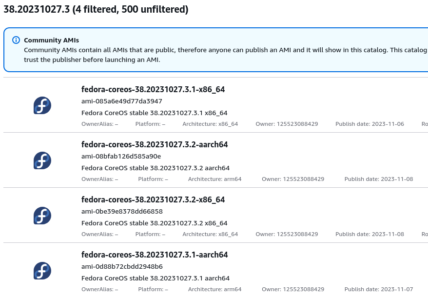

## Missing AWS AMI issue

OKD installation on AWS will fail if the default AMI for EC2 machines is not available.

To check if the default AMI is available:

1. Run the following command using the appropriate version of `openshift-install`:
   ```bash
   ./openshift-install coreos print-stream-json  | jq '.architectures.x86_64.images.aws.regions."us-east-1"'
   {
     "release": "38.20231002.3.1",
     "image": "ami-089899354cd079d56"
   }
   ```

2. Check the AWS Console to see if the AMI exists,
   e.g. https://us-east-1.console.aws.amazon.com/ec2/home?region=us-east-1#Images:visibility=public-images;imageId=ami-089899354cd079d56;v=3 .

If the AMI is not available, we have to find the specific version of Fedora CoreOS AMI that is compatible with the OKD
release.

1. Find the OKD release page on GitHub for the specific installer version,
   e.g. https://github.com/okd-project/okd/releases/tag/4.14.0-0.okd-2024-01-26-175629

2. Look for the field `machine-os` in the release notes, e.g.

   ```
   Component Versions:
     kubernetes 1.27.10       
     machine-os 38.20231027.3 Fedora CoreOS
   ```

3. Search the [AMI Catalog](https://us-east-1.console.aws.amazon.com/ec2/home?region=us-east-1#AMICatalog:) for
   `38.20231027.3` (***not*** `38.20231002.3.1` from the `image` field) in the **Community AMIs** tab. This might take a
   while, be patient.  
   

4. Select the best match for x86_64 architecture and copy the AMI ID, e.g. `ami-0b2f6494ff0b07a0e`.

5. Update the `install-config.yaml` file.
